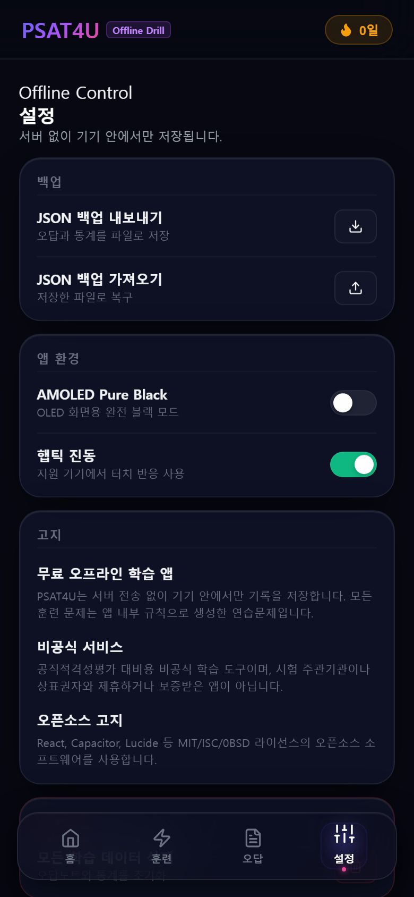

<p align="center">
  
</p>

# PSAT4U

<p align="center">
  <strong>무료 배포 중인 오프라인 PSAT 틈새 훈련 앱</strong><br />
  서버, 로그인, 광고, 분석 SDK 없이 기기 안에서 바로 푸는 모바일 훈련 도구입니다.
</p>

<p align="center">
  <a href="https://github.com/obundh/psat4u/releases/download/v1.0.0/PSAT4U-1.0.0.apk">
    
  </a>
</p>

<p align="center">
  <a href="https://github.com/obundh/psat4u/releases/download/v1.0.0/PSAT4U-1.0.0.apk"><strong>APK 바로 다운로드</strong></a>
  ·
  <a href="https://github.com/obundh/psat4u/releases/tag/v1.0.0">GitHub Release</a>
</p>

> Android에서 직접 APK를 설치할 때는 브라우저 또는 파일 앱의 "알 수 없는 앱 설치" 허용이 필요할 수 있습니다.

## 앱 소개

PSAT4U는 수험생이 이동 중이거나 쉬는 시간에 짧게 PSAT 감각을 유지하도록 만든 무료 앱입니다. 문제는 공식 기출 원문을 넣은 방식이 아니라, 앱 내부 규칙과 난수로 자동 생성되는 연습문제 중심입니다.

주요 기능:

- 오늘의 PSAT 훈련: 원하는 유형을 체크해서 짧은 훈련 코스를 시작
- 난이도 설정: 초급, 중급, 고급 및 난이도 고정
- 유형별 기록: 각 유형별 풀이 시간, 정답률, 최고 기록 저장
- 오답노트: 오답을 유형별 한 줄로 모으고 랜덤으로 다시 풀기
- 나에게 맞는 풀이 찾기: 같은 유형을 여러 풀이법으로 테스트해 주력 풀이 탐색
- 오프라인 저장: 학습 기록은 기기 내부 localStorage에 저장

## 스크린샷

<p align="center">
  
</p>

| 홈 루틴 | 일일훈련 선택 | 유형별 훈련 |
| --- | --- | --- |
|  |  |  |

| 풀이 찾기 | 오답노트 | 설정/고지 |
| --- | --- | --- |
|  |  |  |

## 다운로드 정보

- 최신 배포: [v1.0.0](https://github.com/obundh/psat4u/releases/tag/v1.0.0)
- APK: [PSAT4U-1.0.0.apk](https://github.com/obundh/psat4u/releases/download/v1.0.0/PSAT4U-1.0.0.apk)
- SHA-256: `eb7a044a9db364b6bbf48f48e3d106e00cb21e5742e5ebccd49613095841904e`

## 배포 고지

PSAT4U는 공직적격성평가 대비용 비공식 학습 도구입니다. 시험 주관기관, 상표권자, 출판사, 강의 업체와 제휴하거나 보증받은 앱이 아닙니다.

앱에 포함된 훈련 문제는 앱 내부 규칙으로 생성한 연습문제이며 공식 기출 원문, 상업 교재 문항, 유료 강의 자료를 번들하지 않습니다.

## 개발

```bash
npm install
npm run build
```

Android APK 빌드:

```bash
npm run build
npx cap sync android
.\android\gradlew.bat -p android assembleRelease
```

릴리즈 서명키는 repo에 포함하지 않습니다. 같은 앱을 업데이트하려면 기존 `release/psat4u-release.jks`를 안전하게 보관해야 합니다.

## 라이선스와 고지

오픈소스 의존성 및 배포 관련 고지는 아래 문서를 확인하세요.

- [THIRD_PARTY_NOTICES.md](THIRD_PARTY_NOTICES.md)
- [DISTRIBUTION_NOTICE.md](DISTRIBUTION_NOTICE.md)
